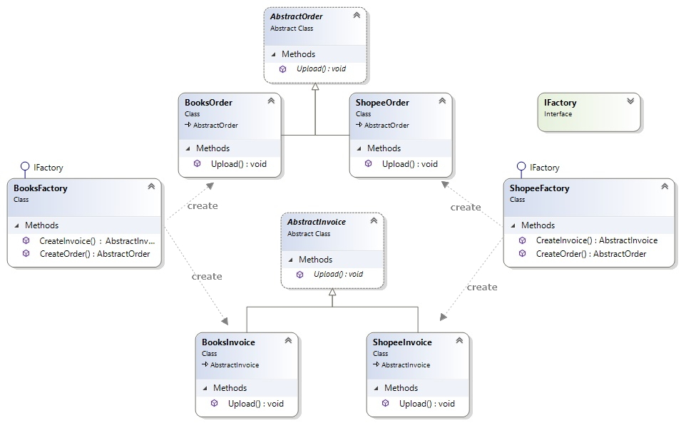

# Abstract Factory 抽象工廠模式

提供一個建立一系列相關或相互依賴物件的介面，而無須指定它們的具體類別。

## 路人旁白

其實就是**工廠方法模式**衍伸，差異就只是建立多個產品。
舉例來說，抽象工廠可以建立抽象的 order 跟 invoice...etc.
它的具象工廠可以建立 A 公司(如蝦皮)的 order 跟 invoice。這裡蝦皮的 order 跟 invoice 就算是一系列的產品，都是屬於蝦皮這個系列。

# 類別圖

