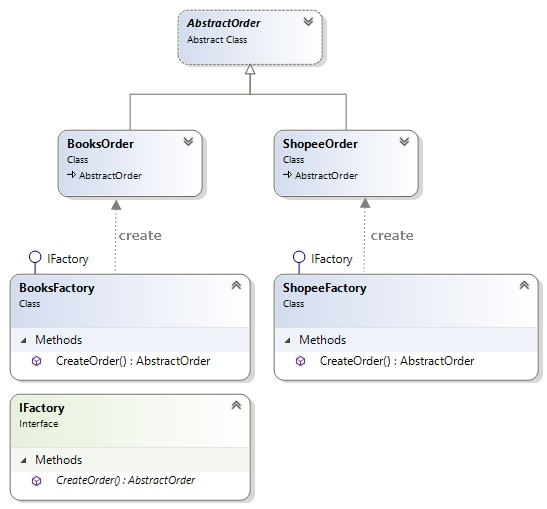

# Factory Method 工廠方法模式

讓類別實體化的動作，交由次類別進行。

- 由次類別建立物件(嚴格說起來, 次類別並沒有「決定」實體化的物件為何, 而是延遲由 client 呼叫端決定)
- 封裝實體化的過程, 實體化的工作被移到一個方法中，此方法就如同是一個「工廠」。如下圖, 由 BooksFactory 的 method (CreateOrder) 實體化 BooksOrder

# 類別圖

# 比較

|  | 描述   |
|-------------|----------|
|Simple Factory|	工廠負責管理所有的具象產品，利用 if else 或 switch case 判斷式來產生何種產品|
|Factory Method|	工廠提升為一個抽象概念，實際上產生產品的是實作工廠概念的具象工廠|

# 參考資料

- https://github.com/BryanYu/DesignPatternPractice/tree/master/FactoryMethod
- 比較表格 [【Design Pattern】4：Factory Method Pattern 工廠方法模式 (創造)](https://spicyboyd.blogspot.com/2018/08/design-pattern4factory-method-pattern.html)
